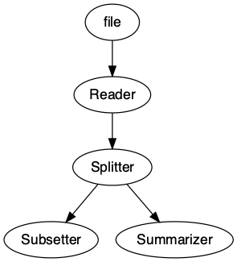

<!-- README.md is generated from README.Rmd. Please edit that file -->

# sewage

<!-- badges: start -->

[](https://github.com/mwhalen18/sewage/actions/workflows/R-CMD-check.yaml)
[](https://lifecycle.r-lib.org/articles/stages.html#experimental)
<!-- badges: end -->

The goal of sewage is to provide a light-weight pipelining interface for
data analyses. It acts as a stop-gap solution between chaotic scripting
and a full-fledged ETL tool.

## Installation

You can install the development version of sewage like so:

``` r
devtools::install_github("mwhalen18/sewage")
```

## Example

Below is an example of a simple pipeline that can be constructed.

``` r
library(sewage)
```

You can use any function as a component in the pipeline, including
custon functions you define or import from an external source.

``` r
subset_data = function(x) {
  subset(x, cyl == 6)
}

summarizer = function(x) {
  return(summary(x[['disp']]))
}
```

Currently, there are 2 components ready for use. Basic `Nodes` and
`Splitters`. Nodes take one object as imput and return exactly one
object. Splitters take in exactly one object and may return any number
of outputs greater than 1.

The first node in your pipeline should specify the argument that will be
passed into the pipeline when we execute it (More on this below).

Note outputs of a Splitter are accessible by specifying the name of the
splitter component (In this case `Splitter`) suffixed with the outgoing
edge in the format `.output_{i}`. Currently this suffix cannot be
modified

``` r
pipeline = Pipeline()

pipeline = pipeline |>
  add_node(component = read.csv, name = "Reader", input = "file") |>
  add_node(component = Splitter(), name = "Splitter", input = "Reader") |>
  add_node(component = subset_data, name = "Subsetter", input = "Splitter.output_2") |>
  add_node(component = summarizer, name = "Summarizer", input = "Splitter.output_1")
```

We can easily visualize our pipeline using the `draw` method.

``` r
draw(pipeline)
```



Here we execute the pipeline with the `run` command. It is important to
note that the argument you pass to run should match the `input` argument
of your first node in your pipeline. In this case we are passing a
`file` argument in `run` and similarly our first node is set to receive
a `file` argument as input.

You may choose any argument you like, as long as these two arguments
match!

``` r
result = run(pipeline, file = 'temp.csv')
```

We can now access the results of our terminating nodes. A terminating
node is any node that is not specified as input. By default when the
pipeline is run, each node will overwrite the output of its input node.
Therefore any node that is not fed forward to a new node will return
output. In the case of this pipeline, the `Subsetter` and `Summarizer`
edges are our terminating nodes. Therefore, we can access their results
in the `outputs` object of the pipeline

``` r
result$outputs$Subsetter
#>                 X  mpg cyl  disp  hp drat    wt  qsec vs am gear carb
#> 1       Mazda RX4 21.0   6 160.0 110 3.90 2.620 16.46  0  1    4    4
#> 2   Mazda RX4 Wag 21.0   6 160.0 110 3.90 2.875 17.02  0  1    4    4
#> 4  Hornet 4 Drive 21.4   6 258.0 110 3.08 3.215 19.44  1  0    3    1
#> 6         Valiant 18.1   6 225.0 105 2.76 3.460 20.22  1  0    3    1
#> 10       Merc 280 19.2   6 167.6 123 3.92 3.440 18.30  1  0    4    4
#> 11      Merc 280C 17.8   6 167.6 123 3.92 3.440 18.90  1  0    4    4
#> 30   Ferrari Dino 19.7   6 145.0 175 3.62 2.770 15.50  0  1    5    6
```

``` r
result$outputs$Summarizer
#>    Min. 1st Qu.  Median    Mean 3rd Qu.    Max. 
#>    71.1   120.8   196.3   230.7   326.0   472.0
```

# Why sewage?

What is the point of `{sewage}` over more robust ETL pipelining tools
like `{targets}` or Airflow? Honestly, if you feel comfortable using
more heavy-weight tools you should. This package privides a light-weight
interface to visualize and organize complex
cleaning/processing/visualization scripts.
